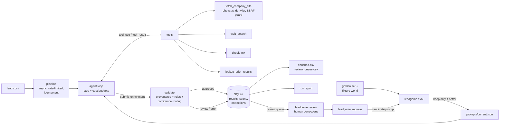

# LeadGenie: an agentic lead-enrichment pipeline that measures itself

LeadGenie takes a messy CSV of B2B leads (name, raw company string, maybe a title) and runs
a tool-using agent on each one. The agent finds the company's site, reads it, checks the
email domain's MX records, reuses prior results, and submits an enrichment in which
**every field carries its source**. Code then checks those sources against what the
tools actually retrieved. Anything uncertain or unverifiable goes to a human review queue.
Human corrections feed a **self-improving loop** that keeps a prompt change only if the
evals say it helped.

The design rests on one belief: agents fail silently, so the "I'm not sure" path, and the
measurement of how often that path fires correctly, have to be built first.

## Architecture



| Module | Responsibility |
|---|---|
| `agent.py` | Tool-use loop. Runs requested tools in parallel, enforces a step budget and a USD budget per lead, warns the model before the budget runs out, and feeds invalid submissions back as tool errors. |
| `tools/` | `fetch_company_site`, `web_search`, `check_mx`, `lookup_prior_results`. Each has an offline fixture backend (evals, CI) and a live backend. Every result records the text it retrieved (`EvidenceLog`). |
| `models.py` | `Enrichment`: every field is `{value, source, evidence, confidence}`. `source` is a retrieved URL, `prior:`/`dns:mx:` ref, `input` or `inferred`. |
| `validate.py` | Checks that each cited source was retrieved this run and that its quoted evidence appears in it. Also applies business rules and caps inferred key fields at 0.6. Routes on the weakest key field's confidence. |
| `pipeline.py` | Async fan-out with a concurrency semaphore and a token-bucket API rate limiter. Skips leads already done; writes each result in one transaction. |
| `store.py` | SQLite: runs, results (the result row *is* the idempotency marker), trace spans, corrections. |
| `tracing.py`, `report.py` | A span per lead, model call and tool call (inputs, outputs, tokens, cost, latency, errors), plus a per-run Markdown/JSON report computed from those spans. |
| `evals/` | Golden-set generator, metrics, outreach checks and LLM judge, eval runner, record/replay cassettes, CI gate. |
| `review.py`, `improve.py` | Human corrections, and the self-improving loop. |

## Reliability patterns kept from v1, and how they changed

1. **Structured output.** v1 forced a JSON schema on a single call. Now the agent finishes
   by calling `submit_enrichment`, a strict tool schema. Pydantic enforces ranges, and a
   violation goes back to the model as a fixable tool error instead of a retry.
2. **Confidence routing to human review.** Still the core idea, now stricter. Routing uses
   the *weakest* key field (company, role, industry). An unsourced (`inferred`) key field
   can never clear the default 0.75 threshold. Citations that weren't retrieved, or quotes
   that don't appear in the cited page, go to review with machine-readable reasons.
3. **Idempotency.** v1 appended a CSV row and *then* flushed a processed-ID file, so a
   crash between the two re-processed the lead and duplicated the row. Now the result row
   is the done-marker, written in one SQLite transaction.
4. **Retries.** Transient API errors (429, 5xx, connection) are retried with backoff by the
   SDK client (`max_retries=4`). A tool failure becomes data for the agent, not a crash.
   A failure that survives retries routes the lead to the queue as `error`; it is never
   dropped.
5. **Observability.** v1 logged one record per lead. Now every model and tool call is a
   span, and the run report is computed from spans rather than from separate bookkeeping.

## Safety and data rules

- **No LinkedIn, no data brokers.** `fetch_company_site` hard-blocks LinkedIn, Facebook,
  Instagram, X/Twitter, Glassdoor, Indeed, ZoomInfo, Crunchbase, Apollo and RocketReach,
  including subdomains and on every redirect hop. It honours `robots.txt` and refuses
  non-public IP addresses.
- **`check_mx` only looks up DNS.** No email is sent.
- **Synthetic data only.** The golden set and its world are generated (`evals/golden.py`).
  Every company, person and page is fictional, on the reserved `.example` TLD. The sample
  `leads.csv` uses invented people.

## Run it

```bash
uv venv && uv pip install -e ".[dev]"        # or: pip install -e ".[dev]"
cp .env.example .env                          # add ANTHROPIC_API_KEY for live calls

# Enrich leads (live web; web_search has no live provider configured, see limitations)
leadgenie run leads.csv
leadgenie run leads.csv --model claude-haiku-4-5 --max-steps 6 --max-cost 0.10
leadgenie run leads.csv --world evals/world.json      # offline fixture web
leadgenie report <run_id>

# Evaluate on the golden set (offline world, real model)
leadgenie eval --split test --record                  # calls the API, saves a cassette
leadgenie eval --split test --replay --gate evals/gate.json   # free, no key

# Measure the outreach judge against hand-labelled lines
leadgenie judge-check --record

# Human review, then the self-improving loop
leadgenie review --reviewer you@example.com
leadgenie improve --iterations 3 --record

# Quality checks (what CI runs)
ruff check . && ruff format --check . && mypy && pytest -q
```

Docker: `docker build -t leadgenie . && docker run --env-file .env leadgenie eval --split test --replay`.

Outputs: `leadgenie.db` (everything), `enriched.csv` and `review_queue.csv` (exports),
`reports/run-<id>.{md,json}`, `results/eval-*.{json,md}`, `results/improve_log.jsonl`.

## How the evals work

**Golden set** (`evals/golden.jsonl`, 60 leads, 30/15/15 train/dev/test split, stratified)
over an **offline world** (`evals/world.json`) of fictional company sites and MX records.
Each lead belongs to a scenario that fixes what the right answer is:

| scenario | what makes it hard | correct outcome |
|---|---|---|
| clean | nothing | approve |
| messy_company | typos, casing, legal suffixes | normalize, approve |
| title_on_site | no title in the row; it's on `/team` | find it, approve |
| lookalike | a similarly named company in another industry exists | pick the right one |
| no_mx | the domain has no MX records | review |
| unidentifiable | "stealth startup", "acme corp": no site exists | review |
| title_unknown | no title, and the person isn't on the site | review |

**Metrics** (`evals/metrics.py`; definitions in the module docstring):

- per-field accuracy and coverage
- expected calibration error with a reliability table
- review-queue precision, recall and F1, where a lead *needs review* if its label says so
  or the agent got a key field wrong
- **unsafe approval rate**: auto-approved leads that needed review
- cost and latency per lead
- outreach quality: deterministic checks (length, generic phrases, personalization,
  grounding, no figures absent from the cited page) plus a rubric-based LLM judge (Sonnet
  judging Opus output)

The judge is itself measured against hand-labelled lines (`leadgenie judge-check`) before
its scores are trusted.

**Cassettes** record every model call keyed by a hash of the full request. CI replays them
with no API key. If the prompt, tools or agent change, replay fails loudly rather than
scoring stale behaviour.

**Self-improving loop** (`leadgenie improve`):
1. Corrections are turned into a candidate prompt, alternating between few-shot lessons
   and an LLM-proposed revision.
2. The candidate is scored on **dev**.
3. It is kept only if the objective (0.5 × key-field accuracy + 0.5 × review F1) rises by
   at least `min_delta` and the unsafe approval rate, ECE and cost per lead don't regress.
4. Baseline and final prompts are both scored on the held-out **test** split, which no
   decision ever saw.

## Results

**No eval has been run against a real model yet.** Running the evals costs API money, and
the spend has not been approved yet. Until it is, this section has no numbers. When runs
happen, every number here will link to its committed file in `results/`, and each file
records the git revision it came from.

## What failed and what I changed

Each item below is a failure that showed up while building this, and the fix it led to.

- **v1 industry drift** (from the original version): the model invented industry labels
  outside the allowlist, so correct leads went to review for label drift. Fix: the enum
  moved into the output schema. It is still checked at runtime as defense in depth.
- **v1 crash window:** appending to the CSV and marking the lead processed were two
  separate steps. Fix: a single SQLite transaction (see *Idempotency* above).
- **`INSERT OR IGNORE` hid bad rows.** The first SQLite version used it for idempotency.
  A test showed it also silently swallows `CHECK` violations, so a malformed status would
  vanish. Fix: `ON CONFLICT(lead_id) DO NOTHING`, which skips only true duplicates.
- **The golden-set generator contradicted itself.** Companies are reused across leads.
  Turning off MX for one `no_mx` lead flipped it for other leads at the same company,
  whose labels still said `accepts_email=True`. A label-vs-world consistency test caught
  it. Fix: dedicated companies for `no_mx`.
- **Unknown models cost $0.** v1's `cost_usd` returned 0 for any model missing from the
  price table, which would silently void cost budgets. Fix: it raises. v1 also priced
  Sonnet 5 at $3/$15 per MTok instead of $2/$10.
- **Citations alone prove nothing.** A schema can force a `source` field, but not a true
  one. Fix: every tool result records the text it retrieved, and validation requires that
  the cited URL was retrieved in this run and that the quote appears in it.

## Known limitations

- **Small, synthetic eval set.** Dev and test have 15 leads each, so one lead moves a
  metric by about 6.7 points and differences of one or two leads are noise. Each
  configuration is run once; there is no repeated-run variance estimate yet.
- **The fixture world tests reasoning, not retrieval.** It measures how well the agent
  uses tool outputs, not how well live fetching and search work on the real web.
- **Simulated reviewers.** No human reviewers exist for the synthetic set. The loop's
  corrections come from auditing the *train* split against labels, with one canned note
  per scenario. Real corrections would be noisier and sparser. They are stored with
  `origin='simulated'` and never come from dev or test.
- **No live web search.** Every search provider is a paid service or needs a new API key.
  Live runs fall back to fetching a guessed domain; the tool interface is ready for a
  provider.
- **The judge's yardstick is small and author-written.** The 12 judge-check lines were
  written and labelled during development, not by an independent annotator.
- **SSRF check has a DNS-rebinding window.** The host is checked when resolved, and the
  HTTP client resolves it again afterwards.
- **Fallback pricing is approximate.** If a refusal fallback serves a turn on a model
  missing from the price table, it is priced as the requested model, and the span records
  that substitution.
- **`lookup_prior_results` is unexercised by evals.** Each eval starts from an empty
  database so that no prior results leak in.

## License

MIT, see `LICENSE`.
